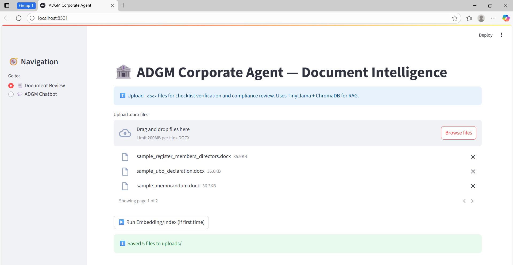
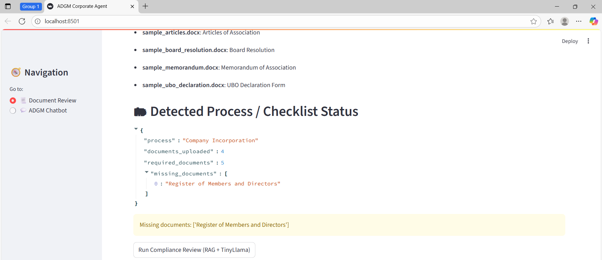
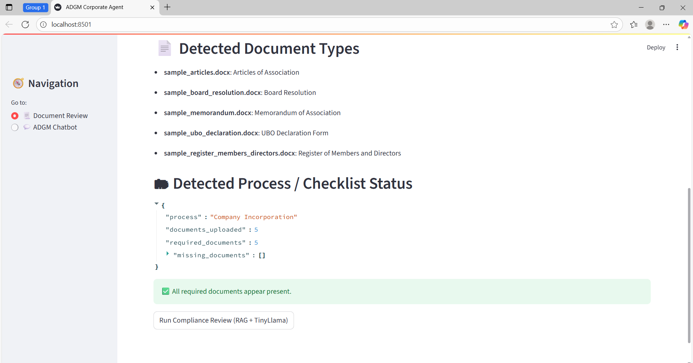
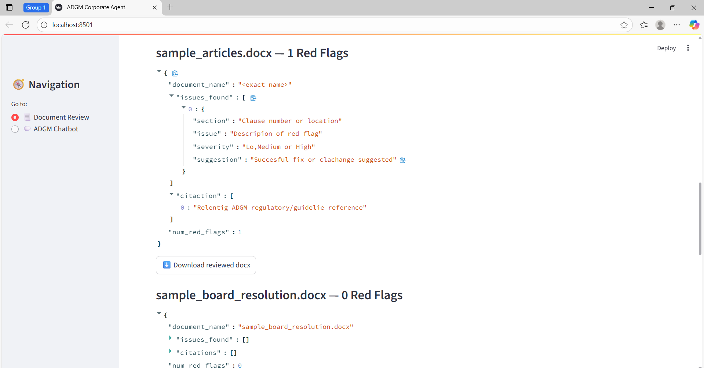
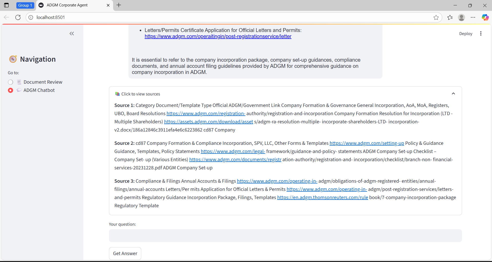

# 🏦 ADGM Corporate Agent — Document Intelligence

An AI-powered legal assistant designed to review, validate, and prepare documentation for business incorporation and compliance within the Abu Dhabi Global Market (ADGM) jurisdiction.  
The system leverages **Retrieval-Augmented Generation (RAG)** with a local **TinyLlama model via Ollama** and **ChromaDB** to ensure compliance with real-world ADGM regulations.

---

## 📚 Table of Contents
1. [Introduction](#-introduction)  
2. [Project Overview](#-project-overview)  
3. [Features](#-features)  
4. [Implementation Details](#-implementation-details)  
5. [Tech Stack](#-tech-stack)  
6. [Folder Structure](#-folder-structure)  
7. [Setup Instructions](#-setup-instructions)  
8. [Usage](#-usage)
9. [Technical Details](#-technical-details)
10. [Overview Screenshots](#-overview-screenshots)  

---

## 📌 Introduction
This project implements the **ADGM Corporate Agent**, an AI-driven tool to assist businesses and individuals in ensuring their incorporation and compliance documents meet the **Abu Dhabi Global Market** (ADGM) legal requirements.  
It verifies mandatory document checklists, highlights red flags, inserts contextual legal comments, and provides a reviewed `.docx` version along with a structured JSON summary.

---

## 📋 Project Overview
- **Purpose:** Automate legal document review for ADGM jurisdiction.
- **Approach:** Retrieval-Augmented Generation (RAG) using official ADGM documents and laws.
- **Outputs:**  
  - Reviewed `.docx` file with inline comments.
  - JSON/Python dictionary summarizing detected red flags and missing documents.
  - Interactive chatbot to query ADGM rules and regulations.

---

## ✨ Features
- 📂 **Multiple Document Upload** — Accepts `.docx` legal documents.
- 🔍 **Document Classification** — Automatically detects document type (e.g., AoA, MoA).
- ✅ **Checklist Verification** — Compares uploaded files against ADGM's required documents.
- 🚨 **Red Flag Detection** — Flags missing clauses, wrong jurisdiction references, and compliance issues.
- 💬 **Inline Legal Comments** — Adds contextual comments with ADGM law citations directly inside `.docx`.
- 🤖 **AI Q&A Chatbot** — Answer ADGM compliance questions using RAG.
- 📊 **JSON Summary Output** — Returns structured data with issue counts and descriptions.
- 📥 **Downloadable Reviewed Documents** — Export fully marked-up `.docx`.

---

## 🛠 Implementation Details
1. **Document Processing** — Uses `python-docx` to parse and annotate `.docx` files.  
2. **Embedding & Retrieval** — Extracts content from ADGM reference PDFs and embeds them into **ChromaDB** for semantic search.  
3. **LLM Integration** — Local **TinyLlama** model is queried via Ollama to generate compliance review notes.  
4. **Checklist Verification** — Matches detected document types against pre-defined ADGM process requirements.  
5. **UI** — Built in **Streamlit** with a sidebar navigation for document review or chatbot mode.  
6. **Expandable Source Citations** — In chatbot answers, sources are hidden under expandable sections for cleaner UI.

---

## 💻 Tech Stack
- **Frontend/UI:** Streamlit  
- **Backend Processing:** Python  
- **Document Handling:** python-docx  
- **Vector Store:** ChromaDB  
- **Embeddings:** Local embedding model (via Ollama)  
- **LLM:** TinyLlama (local, Ollama)  
- **PDF Processing:** PyMuPDF / pdfplumber  

---

## 📂 Folder Structure

```
adgm-corp-agent/
├── data/
│ └── Data Sources.pdf # ADGM reference document
├── adgm_chromadb/ # ChromaDB persistent storage
├── scripts/
│ ├── extract_pdf.py # Extract text from PDFs
│ ├── embed_to_chroma.py # Embed extracted text into ChromaDB
│ └── test_retrieval.py # Test semantic retrieval
├── app/
│ ├── review_pipeline.py # Review logic, checklist verification, JSON output
│ └── docx_utils.py # DOCX parsing and annotation functions
├── screenshots/ # UI screenshots for documentation
├── requirements.txt # Python dependencies
├── README.md # Project documentation (this file)
└── app_streamlit.py # Streamlit UI entry point
```

---

## ⚙️ Setup Instructions
1. **Clone the repository**
```bash
git clone https://github.com/2CentsCapitalHR/ai-engineer-task-smaranng.git
cd ai-engineer-task-smaranng
```
2. **Create and activate a virtual environment**
```bash
python -m venv venv
# Windows
venv\Scripts\activate
# Mac/Linux
source venv/bin/activate
```
3. **Install dependencies**
```bash
pip install -r requirements.txt
```
4. **Ensure Ollama and TinyLlama are installed locally**
- Ollama download link:  https://ollama.com/download
- Ensure Ollama is installed and running.
```
ollama pull tinyllama

ollama run tinyllama

```
5. **Run the embedding process (first-time setup)**
```
python scripts/extract_pdf.py
python scripts/embed_to_chroma.py
```

 ---

## 🚀 Usage
---

1. **Run the Streamlit app**
```
streamlit run app_streamlit.py
```
2. **Choose Mode in Sidebar**

- **Document Review:** Upload .docx files → Get classification, checklist verification, and red flag review.

- **Chatbot:** Ask any ADGM-related legal question with expandable sources.

3. **Download Reviewed Docs** — After compliance review, click the download button to save the marked-up .docx.

---

## 🔍 Technical Details
### RAG Pipeline:

- Extract text from uploaded `.docx` using `python-docx`.

- Retrieve relevant ADGM rules from ChromaDB.

- Pass retrieved context + document content to TinyLlama for analysis.

### Checklist Verification:

- Detects intended legal process (e.g., incorporation, licensing).

- Compares uploaded documents with ADGM’s required list.

### Red Flag Detection:

- Highlights clauses not matching ADGM’s wording.

- Detects jurisdiction mismatches.

- Flags missing signatories.

### Output Format Example:
```
{
  "process": "Company Incorporation",
  "documents_uploaded": 4,
  "required_documents": 5,
  "missing_document": "Register of Members and Directors",
  "num_red_flags": 2,
  "issues_found": [
    {
      "document": "Articles of Association",
      "section": "Clause 3.1",
      "issue": "Jurisdiction clause does not specify ADGM",
      "severity": "High",
      "suggestion": "Update jurisdiction to ADGM Courts."
    }
  ]
}
```

---


## 🖼 Overview Screenshots

### 1. Comprehensive Document Review Dashboard
A unified interface displaying uploaded documents, detected types, and compliance status for quick overview.  




### 2. Automated Document Classification & Checklist Verification
The system identifies document categories and highlights missing files against the ADGM-required checklist. 
 
  


### 3. Inline Red Flag Detection and Legal Commenting
Detected compliance issues are annotated directly in the `.docx` file with contextual legal comments.  




### 4. Interactive ADGM Chatbot Interface
An AI-powered assistant for answering ADGM regulation queries in natural language.  


### 5. Expandable Legal Source Citations in Chat Responses
Sources used for chatbot answers are neatly organized in collapsible sections for a cleaner view.  





